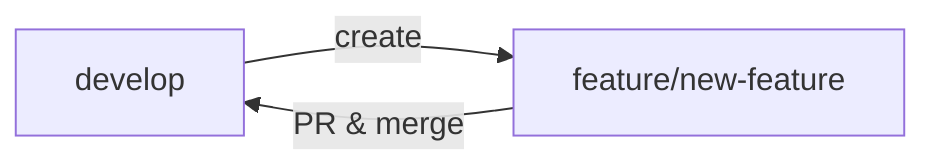
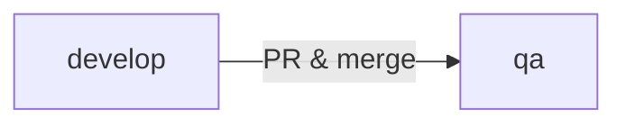
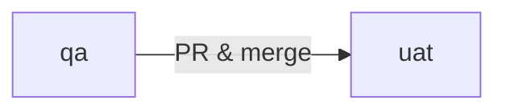
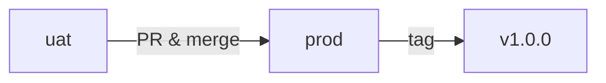
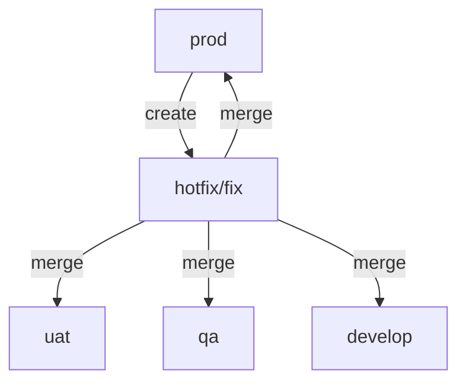

# Git Branching Strategy - FinArif MVP Dashboard

## Branch Structure

This repository follows a **Git Flow** branching model with environment-specific branches.

### Permanent Branches

1. **`prod`** (Production)
   - Production-ready code
   - Deployed to production environment
   - Only accepts merges from `uat` (after full testing)
   - Tagged releases (v1.0.0, v1.1.0, etc.)
   - **Protected**: Requires PR approval
   - **Deployment**: Automatic to production (Vercel)

2. **`uat`** (User Acceptance Testing)
   - Pre-production environment
   - Final testing before production release
   - Accepts merges from `qa`
   - **Testing**: Board review, stakeholder testing
   - **Deployment**: Automatic to UAT environment

3. **`qa`** (Quality Assurance)
   - Testing environment for completed features
   - Accepts merges from `develop` and `hotfix/*` branches
   - **Testing**: Integration testing, QA validation
   - **Deployment**: Automatic to QA environment

4. **`develop`** (Development)
   - Integration branch for ongoing development
   - Accepts merges from `feature/*` branches
   - Always contains latest development changes
   - **Testing**: Developer testing, smoke tests
   - **Deployment**: Automatic to dev environment

5. **`main`** (Legacy/Archive)
   - Initial project setup
   - Can be used as backup/reference
   - Not actively used in workflow

### Temporary Branches

#### Feature Branches: `feature/<feature-name>`
- Created from: `develop`
- Merged back to: `develop`
- Naming: `feature/dashboard-layout`, `feature/transaction-details`
- Lifespan: Until feature is complete and merged

**Example:**
```bash
git checkout develop
git checkout -b feature/risk-analysis-page
# ... work on feature ...
git add .
git commit -m "Add risk analysis page with heat map"
git push origin feature/risk-analysis-page
# Create PR to develop
```

#### Hotfix Branches: `hotfix/<issue-name>`
- Created from: `prod`
- Merged back to: `prod`, `uat`, `qa`, `develop`
- Naming: `hotfix/fix-nim-calculation`, `hotfix/urgent-security-patch`
- Lifespan: Until fix is deployed to production

**Example:**
```bash
git checkout prod
git checkout -b hotfix/fix-capital-cost-calculation
# ... fix the issue ...
git add .
git commit -m "Fix capital cost calculation rounding error"
# Merge to prod, uat, qa, develop
```

#### Release Branches: `release/<version>`
- Created from: `develop`
- Merged back to: `prod` and `develop`
- Naming: `release/v1.0.0`, `release/v1.1.0`
- Lifespan: During release preparation
- Used for: Final QA, version bumps, release notes

---

## Workflow

### 1. Feature Development



**Steps:**
1. Create feature branch from `develop`
2. Develop and commit changes
3. Push to remote
4. Create Pull Request to `develop`
5. Code review and approval
6. Merge to `develop`
7. Delete feature branch

### 2. Promotion to QA



**Steps:**
1. When features are ready for testing
2. Create PR from `develop` to `qa`
3. Merge to `qa`
4. QA team tests in QA environment
5. Fix any bugs in new feature branches

### 3. Promotion to UAT



**Steps:**
1. After QA approval
2. Create PR from `qa` to `uat`
3. Merge to `uat`
4. Stakeholders test in UAT environment
5. Board review if needed

### 4. Production Release



**Steps:**
1. After UAT approval
2. Create PR from `uat` to `prod`
3. Final review
4. Merge to `prod`
5. Tag release version
6. Automatic deployment to production
7. Merge changes back to `develop`

### 5. Hotfix Process



**When to use Hotfixes:**
- Critical bugs in production
- Security vulnerabilities
- Data corruption issues
- UI/UX issues affecting user experience
- Minor formatting/display fixes that don't require full QA cycle

**Steps:**
1. **Create hotfix branch from `prod`**
   ```bash
   git checkout prod
   git pull origin prod
   git checkout -b hotfix/indian-currency-format
   ```

2. **Make changes and test locally**
   ```bash
   # Fix the issue
   npm run build  # Verify build works
   npm run lint   # Check for linting errors
   ```

3. **Commit changes**
   ```bash
   git add -A
   git commit -m "hotfix: add Indian currency formatting (Lakhs/Crores)"
   ```

4. **Merge to `prod` first** (highest priority)
   ```bash
   git checkout prod
   git merge hotfix/indian-currency-format --no-edit
   git push origin prod
   ```

5. **Merge to other branches** (keep all branches in sync)
   ```bash
   # UAT
   git checkout uat
   git merge hotfix/indian-currency-format --no-edit
   git push origin uat

   # QA
   git checkout qa
   git merge hotfix/indian-currency-format --no-edit
   git push origin qa

   # Develop
   git checkout develop
   git merge hotfix/indian-currency-format --no-edit
   git push origin develop
   ```

6. **Verify deployments**
   - Check Vercel dashboard for successful deployments
   - Test on production URL
   - Verify all environments are in sync

7. **Optional: Tag version** (for tracking)
   ```bash
   git checkout prod
   git tag -a v1.0.1-hotfix -m "Hotfix: Indian currency formatting"
   git push origin v1.0.1-hotfix
   ```

**Real Example:**
```bash
# Hotfix: Add Indian Lakh/Crore currency formatting
git checkout prod
git checkout -b hotfix/indian-currency-format
# ... make changes to lib/utils/format.ts ...
# ... update all dashboard pages to use formatCentsIndian() ...
npm run build  # ✅ Build successful
git add -A
git commit -m "hotfix: add Indian currency formatting"
git checkout prod && git merge hotfix/indian-currency-format --no-edit
git push origin prod  # 🚀 Deploys to production immediately
# Merge to uat, qa, develop to keep branches in sync
```

---

## Branch Protection Rules

### `prod` Branch
- ✅ Require pull request reviews (1 approver minimum)
- ✅ Require status checks to pass
- ✅ Require branches to be up to date
- ✅ Include administrators
- ❌ Allow force pushes
- ❌ Allow deletions

### `uat` Branch
- ✅ Require pull request reviews
- ✅ Require status checks to pass
- ❌ Allow force pushes
- ❌ Allow deletions

### `qa` Branch
- ✅ Require pull request
- ✅ Require status checks to pass
- ❌ Allow force pushes

### `develop` Branch
- ✅ Require pull request
- ⚠️ Optional: Require status checks
- ❌ Allow force pushes

---

## Commit Message Convention

Follow **Conventional Commits** specification:

```
<type>(<scope>): <subject>

<body>

<footer>
```

### Types:
- `feat`: New feature
- `fix`: Bug fix
- `docs`: Documentation changes
- `style`: Code style changes (formatting, semicolons, etc.)
- `refactor`: Code refactoring
- `perf`: Performance improvements
- `test`: Adding/updating tests
- `chore`: Build process, tooling, dependencies

### Examples:
```bash
feat(dashboard): add portfolio metrics cards
fix(risk): correct NIM calculation rounding
docs(readme): update installation instructions
refactor(transactions): optimize filtering logic
```

---

## CI/CD Pipeline

### On Push to `develop`:
1. Run TypeScript checks
2. Run ESLint
3. Build project
4. Deploy to Dev environment

### On PR to `qa`:
1. Run all checks above
2. Run integration tests
3. Deploy to QA environment (on merge)

### On PR to `uat`:
1. Run all checks above
2. Run E2E tests
3. Deploy to UAT environment (on merge)

### On PR to `prod`:
1. Run all checks and tests
2. Build production bundle
3. Deploy to Production (on merge)
4. Create GitHub release with tag

---

## Version Tagging

Use **Semantic Versioning**: `MAJOR.MINOR.PATCH`

- **MAJOR**: Breaking changes
- **MINOR**: New features (backward compatible)
- **PATCH**: Bug fixes

**Examples:**
- `v1.0.0` - Initial MVP release
- `v1.1.0` - Added new transaction filters
- `v1.1.1` - Fixed NIM calculation bug

**Tagging Process:**
```bash
git checkout prod
git pull origin prod
git tag -a v1.0.0 -m "Release version 1.0.0 - MVP Dashboard"
git push origin v1.0.0
```

---

## Environment URLs

| Environment | Branch | URL | Purpose |
|-------------|--------|-----|---------|
| Development | `develop` | https://finarif-dev.vercel.app | Active development |
| QA | `qa` | https://finarif-qa.vercel.app | Quality assurance testing |
| UAT | `uat` | https://finarif-uat.vercel.app | User acceptance testing |
| Production | `prod` | https://finarif.vercel.app | Live production site |

---

## Quick Reference Commands

### Start New Feature
```bash
git checkout develop
git pull origin develop
git checkout -b feature/my-new-feature
```

### Finish Feature
```bash
git add .
git commit -m "feat(scope): description"
git push origin feature/my-new-feature
# Create PR on GitHub: feature/my-new-feature → develop
```

### Promote to QA
```bash
git checkout qa
git pull origin qa
git merge develop
git push origin qa
# Or create PR on GitHub: develop → qa
```

### Emergency Hotfix
```bash
git checkout prod
git pull origin prod
git checkout -b hotfix/critical-fix
# ... make fix ...
git add .
git commit -m "hotfix: fix critical issue"
git checkout prod && git merge hotfix/critical-fix
git checkout uat && git merge hotfix/critical-fix
git checkout qa && git merge hotfix/critical-fix
git checkout develop && git merge hotfix/critical-fix
git push origin prod uat qa develop
git branch -d hotfix/critical-fix
```

---

## Best Practices

1. **Always create PRs** - Never push directly to protected branches
2. **Keep branches up to date** - Regularly merge develop into your feature branch
3. **Write descriptive commit messages** - Follow conventional commits
4. **Small, focused commits** - Easier to review and revert if needed
5. **Delete merged branches** - Keep repository clean
6. **Tag all releases** - Maintain version history
7. **Test before merging** - Run local tests before creating PR
8. **Review your own PR first** - Check diff before requesting review

---

## Troubleshooting

### Merge Conflicts
```bash
git checkout develop
git pull origin develop
git checkout feature/my-feature
git merge develop
# Resolve conflicts
git add .
git commit -m "merge: resolve conflicts with develop"
git push origin feature/my-feature
```

### Accidentally Committed to Wrong Branch
```bash
git log  # Find commit hash
git checkout correct-branch
git cherry-pick <commit-hash>
git checkout wrong-branch
git reset --hard HEAD~1  # Remove last commit
```

### Need to Update PR After Review
```bash
# Make requested changes
git add .
git commit -m "refactor: address PR feedback"
git push origin feature/my-feature
# PR updates automatically
```

---

**Questions? Contact the development team.**
